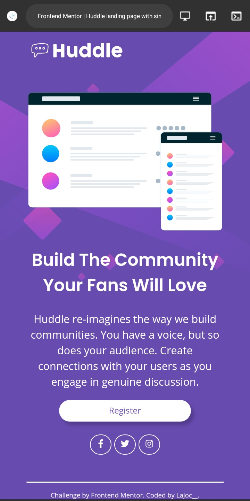

# product-card
We Code |Frontend Mentor - Product preview card component solution
#We Code |Frontend Mentor - Product preview card component solution

This is a solution to the [Product preview card component challenge on Frontend Mentor](https://www.frontendmentor.io/challenges/product-preview-card-component-GO7UmttRfa).

## Table of contents

- [Overview](#overview)
  - [The challenge](#the-challenge)
  - [Screenshot](#screenshot)
  - [Links](#links)
- [My process](#my-process)
  - [Built with](#built-with)
  - [What I learned](#what-i-learned)
  - [Continued development](#continued-development)
  - [Useful resources](#useful-resources)
- [Author](#author)
- [Acknowledgments](#acknowledgments)

## Overview

### The challenge

Users should be able to:

- View the optimal layout depending on their device's screen size
- See hover and focus states for interactive elements

### Screenshot

### Links

- Solution URL: [https://github.com/f-lajoc/product-card] 
- Live Site URL: [https://f-lajoc.github.io/product-card/]

## My process

### Built with

- Semantic HTML5 markup
- CSS custom properties
- Flexbox
- Media Query
- Mobile-first workflow

**Note: These are just examples. Delete this note and replace the list above with your own choices**

### What I learned

To really use Flexbox,

Using 'content property' in css to add images instead of background image or not putting the image in my html.

'em unit' can be used for images and still turn out pretty

### Continued development

I would love to get better at Flex

Start using 'picture element'(srcset) for Responsiveness in my coming projects

### Useful resources

- [https://css-tricks.com/snippets/css/a-guide-to-flexbox/] - Helpful for Flexbox
- [https://www.google.com]- Random search when I'm stuck

## Author

- Frontend Mentor - [@lajoc__](https://www.frontendmentor.io/profile/lajoc__)
- Twitter - [@lajoc__](https://www.twitter.com/lajoc__)
- Instagram - [@lajoc_devs](https://www.instagram.com/lajoc_devs)
- Codepen - [@lajoc__](https://codepen.io/lajoc__/pen/bGvYWjR)

## Acknowledgments

- [https://chat.whatsapp.com/HuXBHuj3RMz2XKyRP0vakV] - We code for the project
- [https://github.com/theCephas]- D'Cephas helped me with responsiveness
